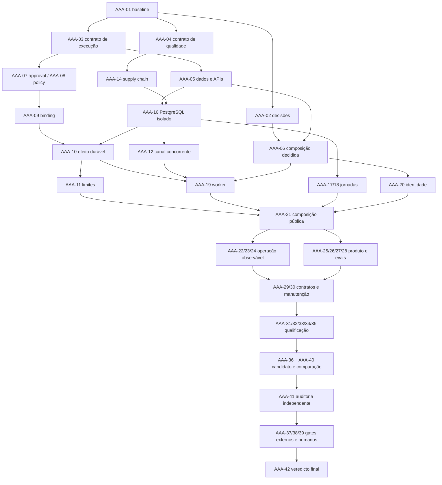

# 0325 — Roadmap de execução multiagente AAA

> Execução vigente: [coordenação da rodada 2](0327_aaa_round2_coordination.md), com três agentes e revisão alternada. AAA-16 não bloqueia AAA-07/08/09; observar suas dependências específicas e os gates aplicáveis. As janelas de quatro slots descritas no baseline devem ser adaptadas ao ledger vivo.

Programa `AAA-20260912`. Referências: [plano executivo e gates](0324_aaa_executive_plan.md), [backlog detalhado](0326_aaa_backlog.md), [DAG/status canônico](tracking/aaa_program_backlog.json).

**Seis fases, seis sprints de aceite, 42 tasks.** A ordem abaixo organiza capacidade; o DAG e os gates decidem o que pode começar. Não há data de produção prometida. Fases podem sobrepor preparação em arquivos disjuntos; nenhum gate é dispensado por paralelismo.

## Fases, demonstrações e saídas

| Fase/sprint                               | Tasks                | Resultado demonstrável                                                                                                                                       | Gate de saída                                                                                                                       |
| ----------------------------------------- | -------------------- | ------------------------------------------------------------------------------------------------------------------------------------------------------------ | ----------------------------------------------------------------------------------------------------------------------------------- |
| P0/S0 — Baseline e contratos              | AAA-01–06            | Candidato identificado, decisões preparadas, contratos de execução/dados/composição/qualidade revisáveis; SPEC congela WHAT/HOW.                             | G_PLAN concluído; G_SPEC por task emitido por autoridade aplicável. D01 pendente bloqueia composição, não correções isoladas.       |
| P1/S1 — Integridade e qualificação básica | AAA-07–16            | Payload executado coincide com aprovado; sem falso EXECUTED/duplicação, limites funcionam; dependências/certificado/formato e banco descartável disponíveis. | G_INTEGRITY + gate PostgreSQL sem skips para fechar efeito durável; revisão fresca dos negativos.                                   |
| P2/S2 — Fluxo durável integrado           | AAA-17–24            | Jornadas SQL, identidade confiável, worker contínuo, runtime conectado, probes e telemetria/ledger no mesmo fluxo.                                           | HTTP→SQL→worker→efeito falso→audit passa com restart/falhas, sem bypass; P10-B01 precede fechamento P10-B02 e este precede P10-B03. |
| P3/S3 — Produto, IA e console             | AAA-25–30            | RAG com proveniência, adapters simulados, eval do entrypoint, UI segura/acessível, contratos e hotspots tratados.                                            | Jornadas e negações de ponta a ponta passam; holdout separado; nenhuma dependência de papel autoatribuído no console qualificado.   |
| P4/S4 — Qualificação e comparação         | AAA-31–36, AAA-40–41 | Carga PostgreSQL, restore, segurança, coverage real, docs atuais, candidato congelado e comparação reproduzível; crítico reatribui A01–A20.                  | G_QUALITY; relatório técnico limitado quando faltarem externos; não elevar produção por média.                                      |
| P5/S5 — Homologação e veredicto           | AAA-37–39, AAA-42    | Integrações autorizadas e operação supervisionada com dados sintéticos, signoff humano e avaliação final.                                                    | G_EXTERNAL/G_HUMAN/G_FINAL aplicáveis; ausência de autoridade/evidência mantém gate pendente. Sem deploy automático.                |

AAA-16 pertence a P1 por ser pré-requisito da prova de durabilidade, apesar do tema ser dados. AAA-40 e AAA-41 pertencem a P4 e precedem AAA-37; os IDs são estáveis e não indicam ordem numérica obrigatória.

## Dependências críticas

Diagrama resume grupos e junções; a lista exata de dependências por task é o JSON. Compartilhar um nó de fase no diagrama não cria permissão de escrita concorrente.

## Alocação por prontidão e conflitos

| Janela candidata        | Builder A                                             | Builder B                                        | Lead / crítico                                                                                |
| ----------------------- | ----------------------------------------------------- | ------------------------------------------------ | --------------------------------------------------------------------------------------------- |
| Contratos após baseline | AAA-03 execução                                       | AAA-04 qualidade                                 | Lead prepara decisões/AAA-05; crítico revisa contratos. AAA-06 aguarda D01 quando necessário. |
| Fundamentos aprovados   | AAA-07 approval                                       | AAA-08 policy                                    | Lead agenda AAA-14/15 em janela exclusiva; crítico testa contratos.                           |
| Banco e binding         | AAA-16 PostgreSQL após AAA-14                         | AAA-09 binding após AAA-07/08                    | Sem escrita nos mesmos testes/migrations; crítico julga os resultados separadamente.          |
| Integridade distribuída | AAA-10→11 runtime                                     | AAA-12 canal                                     | Paths comuns de persistência/exports/migrations reservados; conflito exige serialização.      |
| Durabilidade de produto | AAA-19 worker                                         | AAA-17 jornadas SQL                              | Lead integra AAA-18/20 serialmente; crítico verifica replay e auth.                           |
| Integração              | Testes/fixtures da composição                         | AAA-13 certificado, se ainda pendente e disjunto | Lead exclusivo em AAA-21; congelar candidato antes da revisão.                                |
| Probes/telemetria       | Helpers de AAA-22/23 com ownership exato              | Preparação AAA-25/26 em módulos disjuntos        | Lead integra hooks; AAA-24 aguarda contratos e janela SQL exclusiva.                          |
| Produto                 | AAA-25→27 RAG/evals, conforme DAG                     | AAA-28 console                                   | AAA-26 e qualquer conflito de adapters exigem agenda; crítico observa API/UI.                 |
| Qualificação            | AAA-31 carga em recursos isolados                     | AAA-33 revisão de segurança em outro ambiente    | Não gerar coverage/certificação global simultaneamente; lead coordena AAA-32–36.              |
| Parecer                 | Correções solicitadas pelo crítico nos arquivos donos | Benchmarks AAA-40                                | AAA-41 crítico fresco somente após candidato integrado/congelado.                             |

Estas são oportunidades condicionais, não lote pronto. AAA-13 altera `certification/`; nenhum outro gerador escreve ali na mesma janela. AAA-10 e AAA-12 só rodam juntos após delimitar o adapter durável do canal e a reserva de migrations/exports. Se partilharem arquivos, executar em sequência.

## Gates existentes e continuidade

- P10-B01 → AAA-16; prova local não encerra automaticamente um gate que exija ambiente externo específico.
- P10-B02 → AAA-21; sua dependência P10-B01 permanece. P10-B03 → AAA-23, após composição.
- P10-B04 → AAA-32/39 e D03; laboratório prepara, medição no ambiente relevante e metas aprovadas qualificam.
- P10-B05 → AAA-26 (simulado) e AAA-37 (homologação autorizada). P10-B08 → AAA-38.
- P10-B06 → AAA-31; P10-B07 → AAA-24; P10-B09 → AAA-28; P10-B10 → AAA-20.
- RF-011/REM-02 → D01/AAA-02/06; nenhuma escolha implícita de framework. REM-29 conserva o NO-GO histórico; tasks REM concluídas não serão reabertas sem evento explícito. REM-30 opcional não obriga reescrita.

## Demonstração de cada sprint

1. Integrador congela candidato/contratos e identifica diffs de todas as lanes.
2. Builders entregam testes e manifesto por task; crítico tenta violar invariantes no artefato real.
3. Rodar `npm test`, typecheck, lint e coverage; quando aplicáveis, `test:postgres` sem skips, E2E, worker, audit, imagem, evals e chaos. Não repetir sem mudança ou motivo técnico.
4. Verificar resultado público/persistente e recomputar manifest; nenhum êxito de biblioteca isolada fecha integração.
5. Atualizar JSON, evidência, log e runtime; registrar bloqueio/gate humano no item específico. Fechar sprint somente com seus aceites, sem afirmar conclusão do programa todo.

## Interrupção e replanejamento

Reabrir a task e dependentes quando mudar contrato, source relevante, esquema, política, biblioteca ou premissa operacional. Falha de integridade bloqueia promoção. Falha de ambiente fica separada de falha de produto; não inventar PASS nem instalar/usar um banco operacional para contornar indisponibilidade.

Prioridade de recuperação: conter efeito, preservar candidato/logs, reproduzir, corrigir task dona, rever independência e integrar. Replanejar tarefas grandes/ambíguas antes de delegar; estimativas e datas só após contrato, ambiente e capacidade reais conhecidos.
