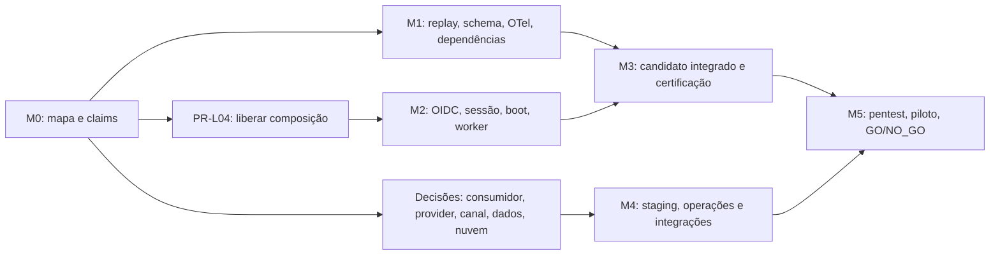

# Roadmap de correção — AUD-0590

**Data-base:** 28/09/2026. **Estado:** proposta de execução T1; produção `NO_GO`.
**Fonte:** [auditoria AUD-0590](../04_audit/0590_deep_system_audit_2026-09-28.md),
[plano executivo 0354](0354_production_executive_plan_2026-09-26.md),
[roadmap 0355](0355_production_roadmap_2026-09-26.md) e
[backlog canônico 0356](0356_production_backlog_2026-09-26.md).
O [backlog complementar 0361](0361_aud0590_remediation_backlog.md) liga cada
achado a uma task existente e define a próxima prova. Este documento ordena o
trabalho; não concede aprovação de SPEC, BUILD T3/T4, dados reais ou release.

## Resultado que este plano busca

Produzir **um candidato integrado identificável**, com invariantes de
segurança comprovadas, console utilizável sob sessão confiável e evidências
reproduzíveis para o **mesmo SHA, digest e configuração**. A liberação
controlada continua condicionada às 13 exigências do [0354](0354_production_executive_plan_2026-09-26.md#2-definição-de-pronto-para-produção),
incluindo decisões externas, staging, pentest, piloto e autorização humana.

A média 68/100 da auditoria mede maturidade de componentes. A prontidão
30/100 mede evidência dos gates de liberação. Nenhuma meta numérica de nota
substitui um gate obrigatório; a próxima auditoria deve recalcular as notas
com rubrica declarada e dados do candidato novo.

## Princípios de sequenciamento

1. **Primeiro eliminar falsos sinais de segurança.** Replay, preflight,
   redação de telemetria e advisories aplicáveis têm regressões negativas
   reproduzíveis. Corrigi-los em fatias isoladas e retestar no candidato
   integrado. Os achados F01/F02/F03 são riscos de fronteira, sem incidente
   real demonstrado pela auditoria.
2. **Compor antes de certificar.** Peças de OIDC, sessão e worker aprovadas
   isoladamente só passam a contar para release após a composição no entrypoint
   publicado. PR-L04 libera caminhos compartilhados; não sobrescrever claims.
3. **Congelar uma única baseline de qualificação.** Corrigir matriz de
   navegadores, catálogo de skips, cobertura, CI e certificado sobre os mesmos
   bytes. Um certificado antigo ou de worktree não qualifica o root atual.
4. **Decisões de produto e operação andam em paralelo.** Escolha de consumidor,
   provider, canal, fonte, retenção, nuvem e responsáveis precede a ativação
   real; não depende de esperar toda a refatoração local.
5. **Sem datas artificiais.** O próximo marco começa quando seus critérios de
   entrada existem; estimar calendário requer capacidade de equipe, tempo de
   revisão e decisões externas ainda não observados.

## Marcos e critérios de saída

| Marco                                   | Objetivo e entregável demonstrável                                                                             | Dependência de entrada                                                                           | Saída verificável                                                                                                                                               |
| --------------------------------------- | -------------------------------------------------------------------------------------------------------------- | ------------------------------------------------------------------------------------------------ | --------------------------------------------------------------------------------------------------------------------------------------------------------------- |
| M0 — Baseline e coordenação             | Inventário dos SHAs, claims, worktrees, SPECs e itens P0/P1; selecionar primeiro candidato de integração.      | AUD-0590 e backlog 0356.                                                                         | Um mapa candidato → fonte → evidência; dono por fatia; nenhuma aprovação isolada atribuída ao root.                                                             |
| M1 — Fronteiras seguras                 | Fechar replay temporal F01, validação de schema F02, redação OTel F03 e dependências F05; preservar negativos. | SPEC/gate T3 aplicável, claim de lockfile quando necessário; fatias independentes podem avançar. | Negativos em memória/PostgreSQL/SDK e auditoria de dependências passam no mesmo código que será integrado; achados relevantes adjudicados.                      |
| M2 — Composição operacional             | Integrar PR-L04 e fatias de OIDC/sessão, web, boot, migração separada e worker neutro.                         | Paths PR-L04 liberados; contratos e aprovações T3 existentes.                                    | Entry point real: login MFA, cookie entre requisições/réplicas, logout/revogação, tenant/RBAC, boot sem credencial DDL; fluxo de referência neutro.             |
| M3 — Qualificação do candidato          | Fechar F06–F09: navegador, skips, cobertura, CodeQL/CI, artefatos e certificado.                               | M1+M2 integrados e baseline congelada para a rodada.                                             | Node 22/PostgreSQL sem skips; matriz completa de navegadores; `certification:verify` exit 0; Verify/Security/CodeQL e atestação vinculados ao mesmo SHA/digest. |
| M4 — Operação e capacidades controladas | Fechar fonte institucional, retenção/purge, cofre, PITR, SLO/alertas, runbooks e integrações autorizadas.      | Decisões PR-103–107, 401/407 e SPECs T3/T4; staging limitado.                                    | Provas de revogação de fonte, minimização, deduplicação externa, eliminação fictícia, restore RPO/RTO, alerta com dono e pausa/degradação.                      |
| M5 — Piloto e decisão                   | Executar pentest, E2E/UAT, piloto do primeiro consumidor e auditoria final.                                    | M3+M4 e 13 condições G01–G13 verificáveis no mesmo candidato/configuração.                       | Zero P0/P1 aberto, pentest sem crítico/alto aberto, critérios do piloto atingidos e decisão humana hash-bound registrada.                                       |

**Regra de avanço:** M1 pode ocorrer em paralelo a M0/M2 em arquivos sem
conflito. M3 só qualifica bytes integrados. M4 pode preparar decisões e
infraestrutura cedo, mas não ativa efeitos reais antes dos gates. M5 não
transforma uma média favorável em autorização de produção.

## Caminho crítico e paralelismo

- **Paralelo seguro:** F01/F02/F03/F05 em claims disjuntos; decisões
  PR-103–107/401/407; documentação de arquitetura F11; preparação de
  runbooks e critérios de piloto.
- **Serialização necessária:** `apps/api/src/server.ts`/PR-L04 antes da
  composição root; `package-lock.json` com claim exclusivo; catálogo de skips
  após fixar os testes integrados; certificado após congelar candidato;
  push/CI remoto somente com autorização já aplicável.
- **Risco de retrabalho:** alterações de runtime, API ou web após M3 invalidam
  o certificado e exigem nova qualificação do SHA/digest.

## Gates de cada fatia

| Trilha | Uso neste plano                                                 | Prova mínima antes de encerrar a fatia                                                                    |
| ------ | --------------------------------------------------------------- | --------------------------------------------------------------------------------------------------------- |
| T1     | Plano, inventário, arquitetura, ledgers.                        | Links, formato, coerência de IDs e evidência referenciada.                                                |
| T2     | Refatoração sem contrato público.                               | SPEC curta e task; typecheck, lint, testes, PostgreSQL e E2E pertinentes em Node 22; registrar resultado. |
| T3     | Segurança, sessão, schema, policy, approval e contrato público. | T2 + revisão humana explícita da SPEC antes do BUILD; negativos da fronteira real.                        |
| T4     | Provider/canal/dado real/efeito externo ou release.             | Pacote hash-bound, candidato congelado, certificação completa e decisão humana; escopo controlado.        |

O gate específico de cada item está no [backlog 0361](0361_aud0590_remediation_backlog.md).
Os números de testes da AUD-0590 são baseline histórica, não um aceite futuro.

## Próximo incremento executável

1. Reconciliar o mapa M0 com os claims ativos e registrar o SHA de integração
   escolhido. Continuar somente fatias com SPEC aprovada e paths livres.
2. Provar F01/F02/F03/F05 isoladamente, preservando os negativos da auditoria;
   pedir revisão T3 onde pendente. Não declarar fechamento com uma prova de
   worktree apenas.
3. Após PR-L04, integrar identidade/sessão/boot e rodar o caminho público real
   com PostgreSQL, navegador e duas instâncias. Em seguida congelar M3.

**Estado nesta rodada:** roadmap e backlog são propostas documentais; nenhum
BUILD ou novo gate de release foi executado aqui. A evidência de cada marco
passa a valer somente quando observada e registrada no candidato correspondente.
