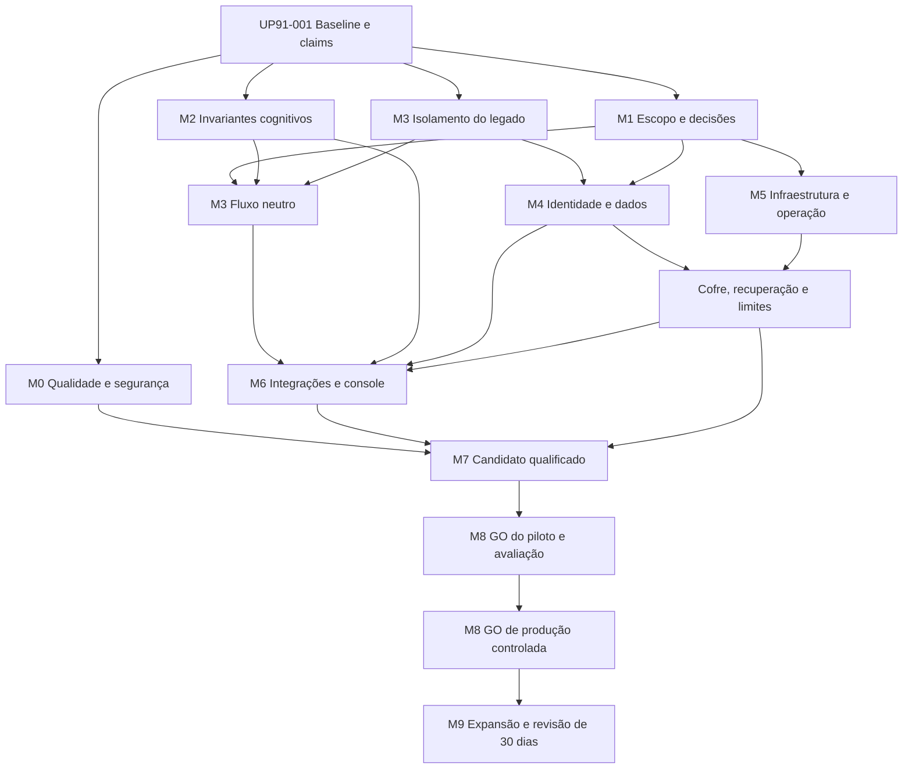

# Roadmap atualizado do programa — CVG Operational Harness — 30/09/2026

> Revisão histórica preservada. Após AUD0592, a versão corrente é [0366_program_roadmap_reaudit_2026-09-30.md](0366_program_roadmap_reaudit_2026-09-30.md).0367 possui o estado UP91;0356 conserva PR. Os resultados e cartões abaixo retratam a revisão anterior, sem reclassificação de aceite.

## Resultado esperado e estado

Transformar a fundação atual em **plataforma neutra, integrada, governada e operável**, com API/worker/console, execução durável, orquestração, contexto, policy, approval, handoff, conhecimento e integrações sob seus contratos. Qualificar um candidato identificável para piloto e, depois da avaliação, produção controlada e expansão por tenant.

**Baseline:** AUD-0591, worktree capturado sobre `f8ccc845e6f177959bc5d40e0cec59c71e595b5b`, branch `aud0578-remediation-20260926`. Maturidade 67/100 em 42 critérios, prontidão 31/100 em 13 gates, NO_GO. Os testes2481/328, PG288/35, simulação12/12 e trusted15/15 passaram no recorte sintético da auditoria. Certificação, audit de dependências e inventários de governança falharam. Esses números são provas da auditoria, **não novas execuções desta rodada de planejamento**.

Entrega `AUD0591-PLAN-001`: planejamento T1 concluído documentalmente; fotografia inicial preservada nas evidências. A implementação integral UP91-EXEC está em andamento sob objetivo explícito posterior do usuário. O estado canônico por cartão e a próxima ação estão no [backlog0364](0364_program_backlog_2026-09-30.md); resultados por candidato no [relatório corrente da rodada3](../04_audit/evidence/UP91-EXEC-20260930/round3-report.md). As autorizações sintéticas anteriores permanecem válidas exclusivamente no escopo/hash registrado. Produção `NO_GO`; progresso documental ou uma subfatia implementada não encerram o programa.

Fontes: [AUD0591](../04_audit/0591_repository_audit_2026-09-30.md), [backlog atualizado0364](0364_program_backlog_2026-09-30.md), [objetivo/gates0354](0354_production_executive_plan_2026-09-26.md), [decisões0357](0357_production_decision_packet_2026-09-26.md), [0356](0356_production_backlog_2026-09-26.md), [0360](0360_aud0590_remediation_roadmap.md), [0361](0361_aud0590_remediation_backlog.md), [0362](0362_aud0590_execution_baseline.md). Esta revisão orienta o sequenciamento operacional em 30/09; preserva as decisões e o histórico anteriores.

## Princípios de execução

1. **Um incremento vertical por vez:** exemplo neutro pelo contrato público, request→worker→PG→policy/approval→efeito sintético/handoff→resposta→console. Exercitar o produto enquanto suas fronteiras amadurecem.
2. **Fechar invariantes antes de providers reais:** transportar contexto/observações, bloquear chamada excedente antes do gasto, impor pisos de policy, vincular prompt e redigir antes dos sinks.
3. **Integrar prova, não só arquivos:** fix F01 janela tardia e F02 preflight já demonstrados; repetir somente regressões necessárias no candidato integrado. Clock durável/reconciliador e branches isolados continuam pendências.
4. **Manter uma fonte por decisão:**0364 possui estadoUP91;0356 possui estadoPR; PRD/SPEC/decision packets possuem autoridade; evidência possui resultado; runtime aponta o trabalho corrente. Não manter status duplicado em roadmap.
5. **Governança proporcional:** documentação T1 pode avançar; contratos/identity/policy/schema T3 exigem SPEC/decisão explícita; provider/canal/dado/efeito/release T4 exigem pacote hash-bound. Sem rebaixar gates, dados reais ou produção irrestrita.
6. **Concorrência por ownership:** consultar coordenação antes de editar; não sobrescrever server/web/lockfile/certification reservados. Ledgers sujos de terceiros recebem handoff, não reescrita.

## Arquitetura de destino

| Superfície                           | Comportamento esperado                                                                                                          | Principal trabalho      |
| ------------------------------------ | ------------------------------------------------------------------------------------------------------------------------------- | ----------------------- |
| Contrato público e consumidor neutro | Produto consome factories/ports versionadas, sem domínio secretário;API declara autoridade por operação                         | 018–024                 |
| Runtime/orchestrator                 | Contexto e observações minimizados; budget por tentativa; decisões sem autoridade de efeito; checkpoint/lease/recovery duráveis | 009–015,020             |
| Model/knowledge gateways             | Prompt realmente aprovado/renderizado, tenant/provenance explícitos, fonte institucional revogável, provider atrás de flag      | 013,015,039–040         |
| Policy/approval/effect               | Piso de risco não redutível, approval ligado ao payload/execução, efeito incerto reconciliado, egress autorizado                | 012,014,027,041–042     |
| API/worker/persistência              | OIDC/storePG no entrypoint, sessão atômica, RLS/roles mínimas, inbox/fencing/clock, migration job separado                      | 025–033                 |
| Console                              | Sessão cookie-only confiável, fluxo neutro, approval/handoff/takeover, teclado/a11y e erro/recovery operáveis                   | 043                     |
| Operação e release                   | IaC/cofre, imagens por digest, atestação externa, PITR, alertas/SLO/on-call, kill switch e gates no mesmo candidato             | 029,034–038,042,045–050 |

O núcleo legado e iterativo existentes são preservados até haver decisão de compatibilidade. A decomposição de hotspots segue boundaries e regressões; remover código/tabelas apenas para atingir uma nota não faz parte do plano.

## Marcos por resultado

Duração é estimativa inicial em semanas úteis após insumos/gates pertinentes disponíveis, sem data de entrega garantida. As fases são frentes com convergência, **não uma fila em que tudo aguarda o término da fase anterior**. O DAG por cartão em0364 define dependências reais; M4 e M5 convergem em cofre/dados/infra. Reestimar após M0/M1 com capacidade da equipe, decisões e integrações confirmadas; não somar durações para prometer prazo global.

| Marco | Resultado                                     | CartõesUP91 | Janela indicativa                     | Condição de saída                                                                                                                                                                                                                       |
| ----- | --------------------------------------------- | ----------- | ------------------------------------- | --------------------------------------------------------------------------------------------------------------------------------------------------------------------------------------------------------------------------------------- |
| M0    | Baseline verificável e higiene                | 001–006     | 1–2 semanas                           | Baseline/holders reconcilados; gates de qualidade/dependências/scan sem falha não adjudicada. As lanes independentes podem começar após001 sem esperar toda a fase.                                                                     |
| M1    | Escopo e decisões de plataforma               | 007–008     | 1–3 semanas, dependente de decisões   | Discovery/PRD pertinentes e parâmetros do consumidor/ambiente aprovados; decisões em aberto explícitas e ligadas às capacidades que bloqueiam.                                                                                          |
| M2    | Governança cognitiva e contratos              | 009–018     | 2–4 semanas                           | Provas negativas A91-03–09/13/14 passam no núcleo e na composição pertinente; API/approval/context/model contracts coerentes.                                                                                                           |
| M3    | Plataforma neutra e manutenção                | 019–024     | 2–4 semanas                           | Fluxo vertical neutro funciona com PG, approval/handoff e recovery; legado isolado; contrato e docs atuais. UP91-021 mantém P1 e os aceites originais de PR-201/202/203; adiamento só com disposição individual e aprovação competente. |
| M4    | Identidade, webhook, segurança e dados        | 025–033     | 3–5 semanas                           | Entry point com OIDC/storePG, atomicidade, replay/reconciliação/preflights e serving mínimo privilégio; retenção/direitos conforme decisões; cofre qualificado em conjunto com M5.                                                      |
| M5    | Infraestrutura e operação recuperável         | 034–037     | 3–6 semanas                           | Ambiente reproduzível, digest/assinatura, cofre/rotação, migration job, PITR e alertas/runbooks exercitados; metas operacionais aprovadas.                                                                                              |
| M6    | Integrações, console e capacidade operacional | 039–044     | 3–6 semanas                           | Providers/canais/fontes selecionados funcionam sob gates próprios; effect journal/handoff/kill switch; console matrizPG/OIDC; evals/redteam pertinentes passam.                                                                         |
| M7    | Qualificação do candidato integrado           | 038,045–046 | 2–4 semanas                           | Carga×3/soak24h e recuperação dentro do SLO; certificado/CI/atestações do mesmo candidato; pentest/UAT/auditoria independentes encerrados.                                                                                              |
| M8    | Piloto e decisão de produção controlada       | 047–050     | mínimo2 semanas de piloto + avaliação | Piloto autorizado limitado, avaliação com critérios aprovados,13 gates pertinentes satisfeitos e decisãoD-15 vinculada a hash/digest/config/escopo.                                                                                     |
| M9    | Expansão e melhoria contínua                  | 051–052     | cadência30dias; expansão por gate     | Onboarding por tenant, revisão30dias e evolução por métricas; retirada definitiva do legado só comDL-05 e proteção de dados/restauração.                                                                                                |

## Caminho crítico e convergências

O diagrama resume convergências; não autoriza editar caminhos nem substitui o DAG 52 verificado. O rollout incorpora021/refactors como P1, preservando aceites originais; adiamento requer disposição individual fundamentada e aprovação competente. MelhoriasP2 podem seguir depois somente quando não forem requisito obrigatório original. A remoção definitiva052 é condicional à decisãoDL-05 e ao backup qualificado; não entra silenciosamente na integração.

## Primeiras três iterações

| Iteração                      | Escopo pronto para preparação                                                                                            | Demonstração/saída                                                                                                                                       |
| ----------------------------- | ------------------------------------------------------------------------------------------------------------------------ | -------------------------------------------------------------------------------------------------------------------------------------------------------- |
| I0 — reconciliação            | UP91-001 e002: identificar holders, baseline e gates; validar correspondência de hashes, atualizar ponteiros via handoff | Lista de fatias liberadas e provas pertinentes; nenhuma integração cega                                                                                  |
| I1 — invariant fixes          | 003–006 e009–018 conforme SPEC/gate/ownership; dividir XL antes de código                                                | Negativos atuais viram regressões; contexto/observações/budget/policy/prompt/redaction comprovados; dependências e inventários reprovados têm disposição |
| I2 — fluxo vertical integrado | 019/020,025–028 e043 por fatias; manter fakes e PG descartável                                                           | Usuário sintético abre solicitação, execução pausa para approval/handoff, retoma e mostra trajetória; tenant/replay/crash negados; sem legado implícito  |

M1 e preparação de infra/privacy avançam em paralelo quando não dependem de decisão ausente. Não é necessário esperar provider/canal/tenant real para corrigir invariantes do contrato atual e demonstrar fluxo neutro sintético. Inversamente, uma fixture neutra não define consumidor nem libera integração real.

## Papéis e colisões de caminhos

| Frente                        | Papel sugerido                       | Paths/recursos que exigem serialização                                                                 |
| ----------------------------- | ------------------------------------ | ------------------------------------------------------------------------------------------------------ |
| Coordenação/qualidade/release | Codex/holder correspondente          | claims, ledgers, scripts de certificação, CI, worktrees e relatórios de release                        |
| Legado                        | Claude Code/holder PR-L04            | server.ts, client/App/journeys, legacy, manifests/lockfile e build configs declarados no claim         |
| Runtime/model/policy          | Engenharia do núcleo                 | shared contracts, hybrid/iterative runtime, gateway e profiles; mudanças cruzadas exigem um integrador |
| Identidade/dados              | Backend/segurança/dados              | server/main composition, session store, migrations, tenant-preflight; aguardar holder do caminho       |
| Console                       | Frontend/UX                          | apps/web, snapshots e Playwright configs/results; alinhar com legado/identidade                        |
| Infra/operação/privacidade    | Donos técnicos e humanos competentes | contas, cofre, DB/backup, on-call, retenção e contratos; não presumir acessos ou responsável nomeado   |

Proposta de WIP: uma task de BUILD por agente, com até três lanes independentes quando equipe/revisores estiverem disponíveis; uma única operação de lockfile/certify/SBOM/licenses por vez. Preparação T1 pode avançar em outra lane sem tocar os paths ocupados. Reviews ativos I18-clock e I11-telemetry e claim clock de hash antigo precisam reconciliação na001; não encerrar, matar ou atribuir ownership desses recursos por este plano.

## Validação e evidência por fronteira

| Fronteira                 | Procedimento previsto                                                                                                     | Prova exigida                                                                                                                |
| ------------------------- | ------------------------------------------------------------------------------------------------------------------------- | ---------------------------------------------------------------------------------------------------------------------------- |
| Documentação T1           | Prettier apenas nos paths próprios, docs:check-links/higiene, JSON e diff pertinentes                                     | Links/format PASS, origem preservada, handoff/ledgers coerentes                                                              |
| Implementação T2/T3       | Node22; typecheck/lint/npm test/test:postgres/E2E; cobertura/evals conforme mudança; SPEC e aprovação T3 quando aplicável | Positivo/negativo no candidato integrado, PG obrigatório sem skips, perda/retomada quando durável                            |
| Invariantes cognitivos    | Requests/outputs observáveis com fakes controlados e composição real local                                                | Conteúdo certo presente, conteúdo/authority proibidos ausentes; budget não excedido antes da chamada; erro não apaga consumo |
| Identidade/schema/efeitos | Entry point PG/OIDC sintético, adversarial schema, tenant/role, crash/restart/lease/commit uncertain                      | Configuração falha fechada, atomicidade e recuperação efetivas; distinção de dedup do destino                                |
| Console                   | Matriz Chromium/Firefox/WebKit,375/768/1440, axe e revisão humana; duas rodadas exigidas pelo runbook no mesmo digest     | Zero skips/flaky, bindings do run, rede/fixtures explicitadas; sessão durável do entrypoint, não só mock                     |
| Operação T4               | Staging autorizado, rotação, PITR, carga×3/soak24h, alerta/handoff/kill switch                                            | Donos/metas aprovados e tempos/resultados medidos; limitações e orçamento registrados                                        |
| Release T4                | Candidato congelado, certify exclusivo, CI remoto, SBOM/licenses/imagem/digest/atestação, finding closures e verifier     | Mesma origem/config/digest em todos os artefatos; proteção/checks; verificador rejeita drift                                 |

Comandos concretos de gates locais existem no package.json; executar apenas os relevantes e autorizados, em recurso próprio ou sob claim. A lista é estratégia futura, não transcrição de comandos executados nesta rodada.

## Gates de liberação e prova-alvo

Todos os13 gates estão sem qualificação integrada na baseline0591. Nenhum número de nota substitui seu aceite obrigatório. Gates abaixo mantêm os critérios de0354; verificar o conteúdo de origem na avaliação de release.

| Gate | Nota na auditoria | Trabalho principal                                                                                                                                                                                                         | Aceite esperado                                                                                                                                                         |
| ---- | ----------------: | -------------------------------------------------------------------------------------------------------------------------------------------------------------------------------------------------------------------------- | ----------------------------------------------------------------------------------------------------------------------------------------------------------------------- |
| G01  |                60 | UP91-019, UP91-020, UP91-021, UP91-022, UP91-023, UP91-052                                                                                                                                                                 | Legado isolado/guard com fluxo neutro integrado; retirada definitiva só conforme DL-05.                                                                                 |
| G02  |                60 | UP91-007, UP91-008, UP91-009, UP91-010, UP91-013, UP91-018, UP91-020, UP91-023, UP91-024, UP91-039, UP91-040, UP91-041, UP91-042, UP91-044                                                                                 | WHAT validado, contrato por capacidade e rastreio requisitos→SPEC→prova do escopo produtivo.                                                                            |
| G03  |                10 | UP91-005, UP91-006, UP91-009, UP91-010, UP91-011, UP91-012, UP91-013, UP91-014, UP91-015, UP91-016, UP91-017, UP91-018, UP91-024, UP91-027, UP91-028, UP91-039, UP91-040, UP91-041, UP91-042, UP91-044, UP91-045, UP91-046 | Zero itens P0/P1 abertos em 0356, conforme0354; sem dispensa por rótuloUP91. Qualquer revisão do critério/escopo exige decisão humana explícita; closures verificáveis. |
| G04  |                35 | UP91-001, UP91-002, UP91-003, UP91-004, UP91-005, UP91-006, UP91-035, UP91-045                                                                                                                                             | CI/qualidade/E2E/certificado/atestação verdes e zero skips no mesmo candidato/config/digest.                                                                            |
| G05  |                40 | UP91-025, UP91-026, UP91-028, UP91-043                                                                                                                                                                                     | IdP/MFA, roles/tenant, revogação e sessão PG no entrypoint e ambiente alvo qualificados.                                                                                |
| G06  |                20 | UP91-008, UP91-029, UP91-034                                                                                                                                                                                               | Cofre/segredos sem valores em artefatos e rotação de cada família exercitada com dono.                                                                                  |
| G07  |                80 | UP91-015, UP91-026, UP91-027, UP91-028, UP91-033                                                                                                                                                                           | RLS obrigatório/rolesmínimas, serving separado de migration e negativos no ambiente alvo.                                                                               |
| G08  |                30 | UP91-030, UP91-031, UP91-032, UP91-036, UP91-040                                                                                                                                                                           | Inventário/retention/direitos aprovados e purge aplicado, inclusive recuperação/backups conforme policy.                                                                |
| G09  |                30 | UP91-034, UP91-036                                                                                                                                                                                                         | PITR/restore efetivos dentro de RPO/RTO aprovados, com consistência e sessões revalidadas.                                                                              |
| G10  |                40 | UP91-008, UP91-017, UP91-034, UP91-037, UP91-038, UP91-042, UP91-048, UP91-051                                                                                                                                             | SLOs/alertas/on-call/handoff/kill switch e carga definidos e exercitados por responsáveis.                                                                              |
| G11  |                 0 | UP91-046                                                                                                                                                                                                                   | Pentest externo qualificado sem crítico/alto aberto; auditoria independente pertinente.                                                                                 |
| G12  |                 0 | UP91-008, UP91-047, UP91-048, UP91-049, UP91-051                                                                                                                                                                           | Consumidor/tenant/SLA definidos, UAT/treinamento e piloto autorizado com avaliação de saída.                                                                            |
| G13  |                 0 | UP91-047, UP91-050, UP91-051                                                                                                                                                                                               | Decisão humana hash-bound do candidato/config/escopo e plano de rollout/rollback.                                                                                       |

UP91-045/046 qualificam tecnicamente o candidato pré-piloto; não afirmam que todas as tasksP0/P1 futuras de 0356 ou13 gates finais já estejam fechados. G03 do 0354 é mantido literalmente para promoção final. Como0356 contém P0/P1 de piloto/expansão/pós-GA, UP91-007 deve preparar uma conciliação formal do critério/baseline; somente decisão humana explícita pode alterá-lo. Sem essa decisão ou satisfação integral do gate original, a promoção final fica NO_GO.

G12 exige evidência do piloto e avaliação para promoção final; o gate de entrada do piloto047 requer os pré-requisitos pertinentes de G12 (consumidor/UAT/limites) e decisãoD-14. O resultado do piloto048/049 completa a condição antes de050. Isso evita exigir experiência de piloto antes de autorizá-lo ou tratar piloto autorizado como produção liberada.

## Indicadores e critérios de sucesso

| Indicador                               | Baseline0591                                      | Alvo/verificação                                                                                                                                           |
| --------------------------------------- | ------------------------------------------------- | ---------------------------------------------------------------------------------------------------------------------------------------------------------- |
| Achados prioritários                    | 23 achados com alcances diferentes                | G03 vigente: zero itensP0/P1 abertos em 0356 na promoção final; findings do candidato fechados;P2 sem requisito obrigatório pendente com dono/prazo aceito |
| Contexto/prompt/budget/policy/redaction | Negativos reproduzidos                            | Cada invariante passa positivo/negativo e composição; não medir sucesso só por aumento de coverage                                                         |
| Testes e cobertura                      | 2481/328, PG288/35; statements92,57/branches87,77 | Zero skips; pisos existentes mantidos; denominadores claros e provas dos caminhos excluídos                                                                |
| E2E                                     | Fixture simulação12/12 e trusted15/15             | Matriz exigida repetida sobre entrypointPG/OIDC e digest final; bindings válidos                                                                           |
| Certificação/CI                         | Root verifier FAIL; checks históricos em outroSHA | Verifier, CI/atestação e closures atuais coerentes; drift negativo recusa                                                                                  |
| Dados/recuperação                       | Sem purge/PITR integrados qualificados            | Policy aprovada, direitos/purge/restore/RPO/RTO demonstrados em ambiente permitido                                                                         |
| Operação                                | Sem SLO/soak/piloto atual qualificado             | SLOs e orçamento decididos em M1; carga×3/24h, alerta/on-call e piloto dentro dos aceites                                                                  |
| Notas de maturidade                     | 67 técnico/31 produção                            | Reauditar mesmas42 dimensões após marcos; aumento como indicador secundário, jamais autorização                                                            |

## Riscos, decisões e recuperação

| Risco/pendência                                        | Ação                                                                                                             | Trabalho                  |
| ------------------------------------------------------ | ---------------------------------------------------------------------------------------------------------------- | ------------------------- |
| Claims antigos/owner desconhecido e paths concorrentes | Recon somente leitura, contactar via coordenação quando permitido; não matar recursos nem limpar worktree alheio | 001/019/025/027           |
| Aprovação antiga não corresponde à SPEC atual          | Vincular entrada, crítico, decisão e hash; T3 humano somente após pacote concreto                                | 017/027 e toda mudança T3 |
| Consumidor/fornecedor/infra indefinidos                | Preparar opções/dados e exigir decisão no gate pertinente, mantendo correções locais independentes               | 007/008/030/034           |
| Build isolado sem integração                           | Integrar fatias autorizadas e repetir provas na composição final; preservar evidência histórica como tal         | 019/025/027/035/045       |
| Replanejamento muito amplo                             | XL vira fatias com outputs verificáveis; revisão de escopo a cada marco; não duplicar tarefas de origem          | 0364                      |
| Perda de dados ou efeito incerto                       | Expand/contract, backup/PITR, journal/fencing e reconciliação; não retry cego                                    | 014/027/031/033/036/041   |
| Nota alta/verde antigo induz promoção                  | Avaliar13 gates no candidato/capacidade atual, com revisão e decisão humana                                      | 045–050                   |

Ao retomar, ler constituição/runtime/log/backlog/coordenação; conferir0364/cartão e source hashes antes de executar. Mudança de fonte/config/modelo/tenant pode invalidar apenas gates afetados conformeD-12; registrar razão e renovar sua prova. Reverter via rollback/roll-forward específico aprovado; nunca usar reset/stash/restore/clean para esconder trabalho concorrente. Operação sensível para no limite de autoridade, mantendo avanço independente permitido.

## Continuidade desta rodada

Não houve BUILD, correção de produto, lockfile, banco, E2E, certificação, push ou deploy. Os ledgers0356/99/20/30 estavam sob edição concorrente e foram preservados; suas entradas atuais estão no [handoff](../08_runtime/handoffs/aud0591_plan_20260930.md). A [evidência de planejamento](../04_audit/evidence/AUD0591-PLAN-20260930/README.md) valida cobertura23/42/13/83 e DAG 52 sem ciclos.

**Próximo passo:** executar UP91-001 em T1 e selecionar a primeira fatia liberada/registrada com SPEC/autoridade pertinente. Manter produçãoNO_GO até qualificação/decisão050. A conclusão do planejamento não afirma conclusão dos marcos futuros.
