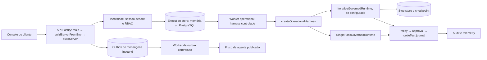

# Implementação atual do CVG — snapshot de 29/09/2026

**Escopo:** guia de leitura da fonte integrada no `main` em `54257e36684907217cd52b74385d5c690a6daf33` (`AUD0590-F11-ARCH-001`, A59-11/F11-F12, T1). O [manifesto de fontes](../04_audit/evidence/AUD0590-EXEC-20260928/F11-architecture/source-manifest.json) registra SHA-256 dos bytes _commitados_ de 24 caminhos, obtidos por `git show <HEAD>:<path>`. O checkout compartilhado tem alterações concorrentes; este documento não as promove a comportamento do snapshot. Onde o código oferece composições opcionais, a configuração concreta decide qual caminho está ativo. A situação de produção continua **NO_GO**.

## Mapa de composição

A entrada HTTP é [apps/api/src/main.ts](../../apps/api/src/main.ts) → `buildServerFromEnv`/`buildServer` em [server.ts](../../apps/api/src/server.ts). A primeira valida ambiente, escolhe memória ou PostgreSQL, exige identidade confiável, RLS e inbound durável em produção e executa preflights. A segunda compõe persistência, autoridade de approval, autenticação, hooks, rotas e observabilidade. `POST /v1/executions` valida a submissão e retorna `202` com execução enfileirada; não executa o harness inline. `GET /v1/executions/:executionId`, `/trajectory`, `/input`, `/cancel` e a rota de decisão de approval consultam ou alteram a execução sob identidade/tenant. As rotas de `tasks` e `approvals` de produto em `server.ts` são contratos distintos da máquina de estados de `OperationalExecutionStore`.

O worker entra por [apps/worker/src/main.ts](../../apps/worker/src/main.ts). O modo `CVG_WORKER_RUNTIME=operational-harness` compõe o worker neutro em [operational-harness-worker.ts](../../apps/worker/src/operational-harness-worker.ts), com store de execução, autoridade de aprovação, effect journal e step store, em memória ou PostgreSQL. O boot rejeita esse modo em produção e exige modo controlado e tenant ([worker.ts](../../apps/worker/src/worker.ts)). O worker da outbox é uma via **separada**: inbound durável entra na outbox em `server.ts`; [continuous-worker.ts](../../apps/worker/src/continuous-worker.ts) reivindica eventos com lease/heartbeat, ack e backoff, e [process-agent-turn.ts](../../apps/worker/src/jobs/process-agent-turn.ts) encaminha o turno ao agente publicado. Não se deve desenhar outbox como fila da rota `/v1/executions`.

## Harness e decisão iterativa

[createOperationalHarness.ts](../../packages/harness/src/createOperationalHarness.ts) é a factory pública. Recebe portas explícitas para modelo, policy, approvals, ferramentas ou capabilities, audit e telemetry. `capabilities` e `tools` são mutuamente exclusivos; capabilities exigem `effectJournal`. Um fingerprint da composição vincula execução durável e retomada; ausência ou divergência encerra com `STATE_CONFLICT`. O perfil padrão é `single_pass`; `iterative` só é executável quando **ambos** `iterativeOrchestrator` e `stepStore` estão presentes. Sem eles, o pedido iterativo falha fechado com `STATE_CONFLICT`. O perfil single-pass usa `SinglePassOrchestrator` e [runtime.ts](../../packages/harness/src/runtime.ts). O iterativo usa [iterative-runtime.ts](../../packages/harness/src/iterative-runtime.ts) e [iterative-dispatch.ts](../../packages/harness/src/iterative-dispatch.ts). O [HybridOrchestrator](../../packages/orchestrator/src/hybrid-orchestrator.ts) é uma implementação disponível: regras determinísticas primeiro; modelo para decisão apenas quando configurado; ele escolhe a ação, sem autorizá-la.

No ciclo iterativo, o runtime valida identidade e budgets, carrega checkpoint do tenant/execução e recusa versão, perfil, fingerprint ou estado terminal incompatível. Monta contexto/observações, obtém decisão, valida tipo/capability, limita reparos e detecta repetição/ciclo. As decisões incluem ferramenta, conhecimento, verificação, replanning, resposta, pergunta, handoff e stop. Após um passo, persiste checkpoint e avalia suficiência/conclusão; budget, evidência insuficiente ou verificação podem encerrar o ciclo. `NEEDS_USER_INPUT` e `APPROVAL_REQUIRED` persistem pausa; retomada exige o vínculo correto, e uma tentativa de tipo ou ID errado preserva o checkpoint. O [step store](../../packages/harness/src/step-store.ts) sela o checkpoint com digest e verifica tenant/execução; [operational-step-postgres.ts](../../packages/persistence/src/operational-step-postgres.ts) fornece a variante PostgreSQL. A configuração de cenário iterativo publicada no worker é **sintética/controlada**, não evidência de provider real ([phase3-synthetic-agent.ts](../../apps/worker/src/phase3-synthetic-agent.ts)).

## Gate de efeito e fronteiras de confiança

Uma decisão `CALL_TOOL` ou `REQUEST_APPROVAL` resolve a ferramenta no catálogo e confere sua exposição ao perfil. `dispatchTool` avalia policy para `tool.execute` **antes** do efeito: `DENY` → `POLICY_DENIED`; `HANDOFF` → `HUMAN_TAKEOVER`; `REQUIRE_APPROVAL`, pedido explícito ou `tool.requiresApproval` → autoridade de approval. `PENDING` grava pausa com ID; `DENIED` bloqueia; `APPROVED` vincula ID, payload, versão da policy e `operationKey`. O runtime grava contagem/decisão em checkpoint e passo `RUNNING` antes da chamada; quando a autoridade fornece a porta de execução, reserva/consome o approval antes do tool. Timeout após início de efeito aprovado é tratado como `unknown_effect`, para reconciliação, não sucesso presumido. Veja [iterative-dispatch.ts](../../packages/harness/src/iterative-dispatch.ts), [effect-journal.ts](../../packages/harness/src/effect-journal.ts) e [execution-spine.ts](../../packages/harness/src/execution-spine.ts). O single-pass também passa por policy/approval/tool em [runtime.ts](../../packages/harness/src/runtime.ts). O módulo [packages/policy/src/policy-engine.ts](../../packages/policy/src/policy-engine.ts) contém a policy conservadora do produto; ele não substitui a porta `PolicyEngine` injetada no harness.

No HTTP, o modo `trusted` usa resolvedor de identidade, sessão por cookie quando configurada, tenant vinculado e RBAC; [operator-identity.ts](../../apps/api/src/operator-identity.ts), [operator-session.ts](../../apps/api/src/operator-session.ts) e [operator-session-hook.ts](../../apps/api/src/operator-session-hook.ts) mostram as fronteiras. No HEAD congelado, o hook rejeita cookie expirado nas rotas que alcança e devolve 503 na falha do store, com exceção explícita de `/v1/session` e `/v1/session/logout`. A exceção adicional para probes de saúde existe apenas em alteração local concorrente ainda não contida neste snapshot; não é garantia do HEAD. A rota de decisão de execução exige `approval:decide`, confere tenant, execução, approval e causalidade antes de reencaminhar o worker. A existência de código de sessão/OIDC ou prova em worktree isolado não certifica o entrypoint integrado corporativo.

## Ciclo exato de uma execução operacional

1. **Gate de entrada:** no modo confiável, cliente autenticado submete `tenantId`, chave de idempotência e `RuntimeInput` em `POST /v1/executions`. A API valida o envelope e grava `RECEIVED → QUEUED`; duplicata da mesma chave retorna o registro existente, conforme [execution-spine.ts](../../packages/harness/src/execution-spine.ts). No modo de teste/simulação, a configuração pode usar memória; o caminho PostgreSQL usa [operational-execution-postgres.ts](../../packages/persistence/src/operational-execution-postgres.ts).
2. **Claim e execução:** `OperationalExecutionWorker.processNext()` recupera leases expirados, reivindica `QUEUED → CLAIMED`, passa a `RUNNING`, mantém heartbeat e chama `createOperationalHarness` com `executionId`, fingerprint e eventual vínculo de retomada. O store exige dono do lease e fence token nas transições.
3. **Decisão e gate:** runtime decide sob budgets; toda ferramenta passa por policy, possível approval e journal antes/depois do efeito. Passos e checkpoint registram estado do iterativo. Audit/telemetry são emitidos; o worker bufferiza eventos do runtime e associa audit à transição, depois tenta descarregar nos sinks originais.
4. **Pausa ou retomada:** `APPROVAL_REQUIRED` com ID durável → `WAITING_APPROVAL`; aprovação autenticada → `QUEUED` com binding para retomar, rejeição → `FAILED_TERMINAL`. `NEEDS_USER_INPUT` → `WAITING_USER`; `POST .../input` vincula resposta e reenfileira. Decisão repetida sem vínculo correto não libera o gate.
5. **Final ou handoff:** `COMPLETED` → `SUCCEEDED`. `HUMAN_TAKEOVER`, `POLICY_DENIED`, `INSUFFICIENT_EVIDENCE`, `UNSAFE_REQUEST`, falha de verificação/loop e limites → `FAILED_TERMINAL` com motivo; handoff é **resultado terminal para o worker**, não ação externa automática. Falha técnica recuperável → `FAILED_RETRYABLE` até limite de tentativas; efeito incerto → `FAILED_TERMINAL`/`UNKNOWN_EFFECT` e reconciliação. Cancelamento autorizado → `CANCELLED`. O mapeamento completo está em `classifyRuntimeResult` de [execution-spine.ts](../../packages/harness/src/execution-spine.ts).

## Persistência, auditoria e operação

A API seleciona repositórios em memória ou PostgreSQL para conversas, tasks, approvals, audit e outbox em `createPersistence` de `server.ts`; a execução operacional tem store próprio. O worker neutro escolhe store, approval authority, journal e checkpoint conforme `DATABASE_URL`. Persistência em memória serve a provas controladas, sem durabilidade entre processos. O runtime inclui `traceId`/`correlationId`, eventos de início, decisão, pausa/fim e telemetria agregada; a API expõe rotas de audit por sessão e evidência. [Postgres audit](../../packages/persistence/src/postgres-audit.ts), [observability](../../packages/observability/src/otel.ts) e logs da API são camadas distintas. A presença de adaptador OTel não prova exportação operacional configurada; F03 acompanha a fronteira de redação. Falha de gravação final de audit no runtime iterativo pode rebaixar o resultado para `INSUFFICIENT_EVIDENCE`, salvo parada por budget com prazo esgotado; falha de flush do worker é sinalizada e exige investigação.

## Estado de integração e navegação

| Superfície                                                 | Estado neste snapshot                                                                                                                                                                                                                                                 |
| ---------------------------------------------------------- | --------------------------------------------------------------------------------------------------------------------------------------------------------------------------------------------------------------------------------------------------------------------- |
| Factory, perfis, gate, execution store e worker controlado | Código no root/HEAD acima; composição depende de portas e ambiente.                                                                                                                                                                                                   |
| Entrada API/sessão corporativa e worker neutro de produção | Não qualificados no candidato final; o worker neutro rejeita `NODE_ENV=production`.                                                                                                                                                                                   |
| PR-L04 e fatias PR-L06–L10/L12, PR-201/202/207             | Frente de isolamento/integração em andamento, com claims próprios; não atribuir provas de branches isolados ao root.                                                                                                                                                  |
| Build e proxy                                              | [build-runtime.mjs](../../scripts/build-runtime.mjs) ainda inclui pacotes `legacy/packages/secretary-*`; [nginx.web.conf](../../deploy/nginx.web.conf) ainda aponta para `secretary-api`; `server.ts` registra `registerSecretaryJourneyRoutes`. F12 continua aberto. |
| Release                                                    | `NO_GO` até composição PR-L04, gates do SHA final, CI/atestação, IAM/staging, integrações/dados autorizados e decisão humana.                                                                                                                                         |

Para leitura histórica, [PUBLIC_API.md](PUBLIC_API.md) e [CURRENT_VS_TARGET.md](CURRENT_VS_TARGET.md) retratam a fundação anterior; este guia os **supersede apenas como ponto de entrada para a implementação no SHA acima**, sem alterá-los. [Runtime V2](../phase3/RUNTIME_V2_ARCHITECTURE.md) e [Phase 4A](../phase4a/CONVERSATIONAL_INTELLIGENCE_ARCHITECTURE.md) preservam design e decisões de fase, não atestam a composição atual. O [achado F11/F12](../04_audit/0590_deep_system_audit_2026-09-28.md), [roadmap 0360](../03_build/0360_aud0590_remediation_roadmap.md) e [backlog 0361](../03_build/0361_aud0590_remediation_backlog.md) controlam o fechamento. Este sidecar documental não fecha F11 integralmente antes da composição PR-L04 nem resolve F12.
