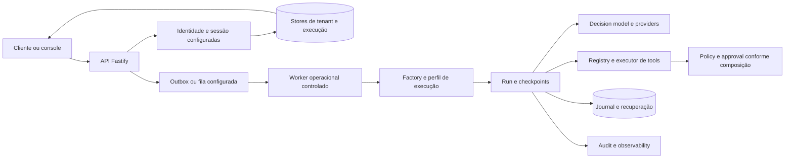

# Implementação atual — captura de 30/09/2026

Este guia descreve as fontes capturadas pela AUD0592, com **produção NO_GO**. Root compartilhado em `f8ccc845e6f177959bc5d40e0cec59c71e595b5b`, com alterações locais e claims concorrentes. A cópia privada foi congelada no commit de captura `3085e865a1e467c7fcc6489c1772b2818dc7f4f9`, limpa antes dos checks; o [manifesto](../04_audit/evidence/AUD0592-REAUDIT-20260930/source-capture.json) identifica os bytes. Não é um commit integrado, uma imagem promovida ou uma nova autorização de release.

O [guia de 29/09](CURRENT_IMPLEMENTATION_2026-09-29.md) conserva seu snapshot em54257e3. O [contrato público](PUBLIC_API.md) possui seu próprio manifesto e recorte de fábrica/runtime. Os links abaixo navegam no checkout móvel; para reproduzir esta captura, conferir hashes do manifesto ou usar a cópia privada preservada. Documentos de fase e SPECs propostas não substituem a composição observada.

## Composição observada

O desenho representa conexões disponíveis. Não comprova que todos os controles opcionais estão ligados no entrypoint publicado nem que capacidades externas estejam habilitadas.

| Fronteira        | Fonte de leitura                                                                                                                                          | Comportamento e limite atual                                                                                                                                                                                                     |
| ---------------- | --------------------------------------------------------------------------------------------------------------------------------------------------------- | -------------------------------------------------------------------------------------------------------------------------------------------------------------------------------------------------------------------------------- |
| API              | [main](../../apps/api/src/main.ts), [server](../../apps/api/src/server.ts)                                                                                | `buildServerFromEnv`/`buildServer` compõem Fastify, rotas, stores e configuração. O entrypoint não demonstra OIDC corporativo e store de sessão durável obrigatórios na configuração de destino                                  |
| Identidade       | [operator-session-hook](../../apps/api/src/operator-session-hook.ts), [auth](../../packages/shared/src/auth.ts)                                           | Sessão/tenant/RBAC existem; probes públicas ficam fora do lookup indevido. `limited/assigned` não comprova associação ao caso em toda leitura; a probe sintética atual retornou200 para dois Operators sem associação registrada |
| Worker           | [operational-harness-worker](../../apps/worker/src/operational-harness-worker.ts), [kernel-composition](../../apps/worker/src/kernel-composition.ts)      | Store de execução e composição PG estão disponíveis. Worker neutro recusa produção por construção; memória/controlado não é canal ou conta real                                                                                  |
| Factory/perfis   | [createOperationalHarness](../../packages/harness/src/createOperationalHarness.ts), [contracts](../../packages/contracts/src/contracts.ts)                | Perfis e registry têm contratos públicos. O lifecycle de approval é opcional no contrato; existência do adapter durável no worker não prova admissão segura em toda composição reutilizável                                      |
| Runtime          | [runtime](../../packages/agent-runtime/src/runtime.ts), [composição](../../packages/agent-runtime/src/composition.ts)                                     | Run/pausa/retomada/checkpoints estão implementados. As extrações internas abaixo preservam fronteiras existentes; não implementam os novos contratos propostos em0166/0167                                                       |
| Policy/approval  | [policy-engine](../../packages/policy-engine/src/engine.ts), [iterative-dispatch](../../packages/harness/src/iterative-dispatch.ts)                       | Grants/rules e approval existem, mas ALLOW pode anteceder pisos e dispatch pode ocorrer sem lifecycle em composições permitidas. UP91-012/014 continuam obrigatórios                                                             |
| Provider/canal   | [model transport](../../packages/model-gateway/src/providers/ssrf-node.ts), [channel transport](../../packages/channel-gateway/src/adapters/ssrf-node.ts) | DNS/origin/egress têm guards. Probes com transporte padrão reproduzem hostname incompatível com Node22 e response204/205/304/HEAD com semântica incorreta; capability real não foi qualificada                                   |
| Dados            | [persistence](../../packages/persistence/src/index.ts), [migrations](../../packages/persistence/migrations)                                               | RLS, preflights, leases, atomicidade e recovery possuem provas PG atuais. High-water/reconciliador/COMMIT do replay, retenção física, direitos e migration separada do serving seguem pendentes                                  |
| Console          | [App](../../apps/web/src/App.tsx), [APIclient](../../apps/web/src/api/client.ts)                                                                          | Simulação e trusted bootstrap são exercitáveis; acessibilidade/teclado/responsividade passaram em fixtures. Login OIDC e restauração por cookie não equivalem a essas provas                                                     |
| Audit/telemetria | [audit](../../packages/persistence/src/postgres-audit.ts), [otel](../../packages/observability/src/otel.ts)                                               | Persistência de audit, logs e exporters são fronteiras distintas. Digest não redige payload; re dação deve anteceder sink/SDK. SPECs e gates correspondentes não foram implementados nesta rodada                                |

## Extrações internas presentes

O runtime principal possui1.498 linhas nesta captura. As fontes [runtime-effect-recovery](../../packages/agent-runtime/src/runtime-effect-recovery.ts), [runtime-approval-request](../../packages/agent-runtime/src/runtime-approval-request.ts), [runtime-effect-identity](../../packages/agent-runtime/src/runtime-effect-identity.ts) e[runtime-execution-context](../../packages/agent-runtime/src/runtime-execution-context.ts) pertencem às extrações T2 anteriores0165/0168. Corpos/contratos foram preservados; o denominador do kernel agrega os cinco arquivos conforme0169. As regressões0171/0172 são entregas parciais verificadas por candidato; os pais do programa continuam abertos enquanto seus aceites integrais não forem satisfeitos.

A governança de contexto, observações, budget, prompt, knowledge, policy e re dação foi especificada nos módulos0166/0167. Esses módulos continuam aguardando a revisão humana já solicitada; a presença dos textos não significa BUILD concluído.

## Prova executável desta captura

O [resumo nativo](../04_audit/evidence/AUD0592-REAUDIT-20260930/native-summary.json) identifica candidatedf8ebc386299 e run correspondente. Node22: typecheck/lint/build passaram; 2.494 testes/330 arquivos e PG288/35 passaram sem skips. E2E de simulação12 e trusted suplementar15 em Chromium/Firefox/WebKit passaram sem skips/flaky; axe6 checks sem violações. São testes locais com dados sintéticos, sem IdP/canal/provider institucional real.

Kernel:branches511/526=97,15%; globalbranches87,83%. O piso local85 passa, mas a margem PR-007 de88 permanece não atingida. O catálogo nativo rejeitou três hashes de fontes. Security reportou três famíliasHIGH. Formato global reprovou três arquivos compartilhados. A certificação saiu1 e não emitiu certificado/results novo porque o parser entregou `metrics.unit:null`. **Testes aprovados não são certificado ou GO.**

O [build de runtime atual](../04_audit/evidence/AUD0592-REAUDIT-20260930/checks/clean-runtime-build.json) compilou18 workspaces sem `dist` herdado usando `TMPDIR` próprio e `--context-dir` dentro dele. Não precisou de patch de tsconfig. Os defaults temporários ainda exigem cuidado em builds concorrentes; `npm ci` limpo e integração final de imagem não foram comprovados por esta execução.

## Legado, decisões e próxima integração

API/web/build/proxy ainda possuem composição ou referências de domínio legado. PR-L04/PR-L08/PR-L09 têm ownership próprio; nenhum path reservado foi sobrescrito. Isolamento de módulo não fecha o literal G01 de0354. A retirada definitiva depende deDL-05 e dos controles de dados/restauração.

O [roadmap0366](../03_build/0366_program_roadmap_reaudit_2026-09-30.md) define destino e ordem; o [backlog0367](../03_build/0367_program_backlog_reaudit_2026-09-30.md) define52 cartões, dependências, aceites e próximas ações.0356 conserva statusPR; 0357/PRD/SPEC conservam autoridade. A [auditoria0592](../04_audit/0592_repository_reaudit_2026-09-30.md) separa fatos provados, inferências estáticas e falta de qualificação operacional. Nenhuma média de notas substitui os13 gates ou a decisão humana vinculada ao candidato.
