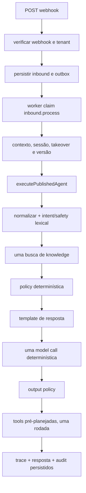

# Runtime atual do agente

## Veredito

**CONFIRMED — `single_pass`, com rollout híbrido de dois caminhos.** O produto executável mantém `published-agent` como default; um kernel governado opt-in foi adicionado no worktree, mas ambos são pipelines lineares por turno. Aprovação divide proposta e execução em turnos distintos, sem criar um ciclo cognitivo.

## Caminho público default

Evidência:

- Ingress, deduplicação e escolha inline/outbox: `apps/api/src/server.ts:533-710` e `packages/agent-core/src/commands/receive-inbound-message.ts :: receiveInboundMessage()`.
- Worker, takeover, contexto e pin de versão: `apps/worker/src/postgres-controlled.ts:294-408`.
- Resolução da publicação: `packages/agent-core/src/commands/execute-published-agent.ts:52-122`.
- Pipeline completo: `packages/platform/src/test-lab.ts:184-517`; existe uma única `modelProvider.complete()` em `:329-344`, seguida de uma única rodada de tools em `:422-434`.

## Caminho opt-in do worktree

`apps/worker/src/kernel-composition.ts` não existe no `HEAD` auditado; é arquivo não rastreado do candidato local. Ele seleciona o kernel apenas com `CVG_WORKER_RUNTIME=kernel`, exige envelope JSON que já escolhe capability/action e monta policy, approval, Model Gateway, journal e outbox sintéticos (`:49-251`, `:283-382`, `:455-530`).

`GovernedAgentRuntime.runTurn()` executa `policy -> uma model call -> approval OU uma tool call -> journal -> outbox -> terminal` (`packages/agent-runtime/src/runtime.ts:371-1013`). Um turno de execução com `approvalId` salta a cognição e consome a proposta congelada (`:695-709`, `:1024+`). Isso é governança transacional, não `observe -> replan`.

## Persistência e auditoria

O caminho durável usa outbox com claim/lease/heartbeat/retry/dead-letter (`apps/worker/src/continuous-worker.ts:107-158`, `:239-440`, `:443-568`), completion transacional do inbound e trace sanitizado. O kernel exige PostgreSQL para effect journal e approvals (`apps/worker/src/kernel-composition.ts:259-382`). O ledger em `packages/observability` é hash-chained, mas a composição mostrada usa instância em memória por processo.

## Divergências relevantes

1. `resolveWorkflowCoordinator()` chama o kernel de default, mas o selector do worker mantém `published-agent` como default; nenhum coordinator é invocado no caminho público.
2. Comentários e campos dizem “loop”, porém os limites contam estágios de um pipeline linear.
3. O Model Gateway genérico existe, mas o runtime default usa `packages/platform/src/model-provider.ts`, hoje determinístico/fake.
4. O commit sozinho não reproduz este relatório: a capability mais nova está no worktree não consolidado.
