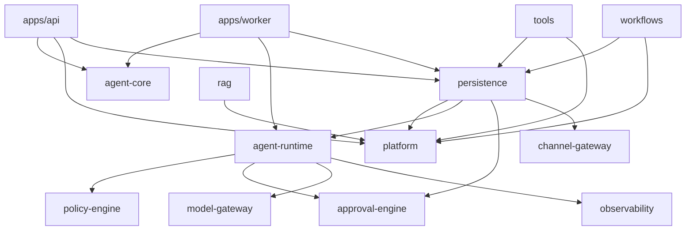
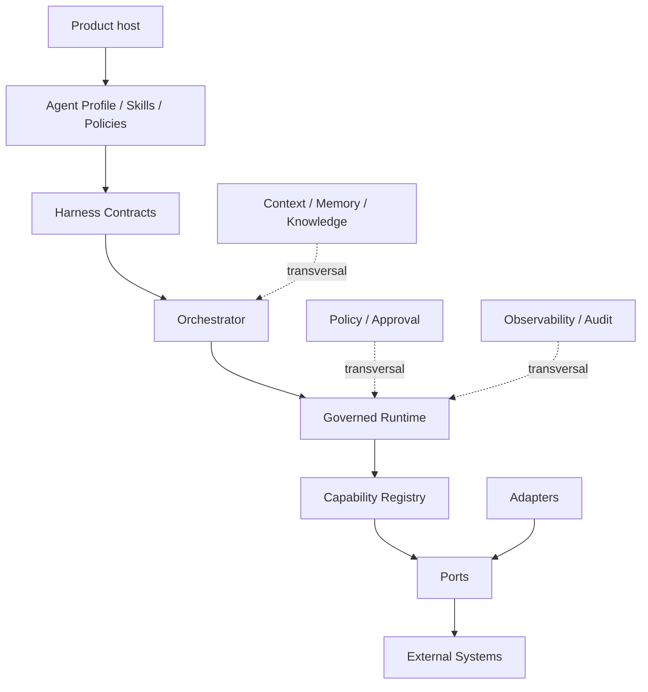

# Direção de dependências

## Grafo atual

## Ciclos e inversões

| Achado                                                                      | Severidade  | Evidência/recomendação                                                                                                                             |
| --------------------------------------------------------------------------- | ----------- | -------------------------------------------------------------------------------------------------------------------------------------------------- |
| persistence importa contracts/implementações de runtime, approval e channel | HIGH        | `packages/persistence/src/{effect-journal-postgres,runtime-approval-store,channel-effect-journal-postgres}.ts`; mover ports para contracts neutros |
| manifests omitem deps reais                                                 | HIGH        | `packages/persistence/package.json` e `apps/worker/package.json` versus imports; gate de build isolado                                             |
| policy core depende de catálogo/profile fechado CVG                         | HIGH        | `packages/policy-engine/src/capabilities.ts`, `grants.ts`; injetar registries                                                                      |
| runtime importa `Capability`/`AgentProfileName` de policy package           | MEDIUM/HIGH | trocar por contracts centrais e registry validado                                                                                                  |
| rag/tools/workflows dependem do mega-package platform                       | MEDIUM      | separar IDs/ports de control plane e produto                                                                                                       |
| dois tool systems e dois policy/runtime paths                               | HIGH        | uma capability contract e adapters de compatibilidade                                                                                              |

Há ciclo conceitual `runtime -> approval contract -> persistence adapter -> runtime contract`, ainda que o TypeScript não forme necessariamente ciclo de carregamento. A ownership direction está invertida.

## Grafo alvo

Regra estrutural: adapters implementam contracts; contracts jamais importam adapters ou produto. Secretary e Corp registram ontologias sem editar core.
