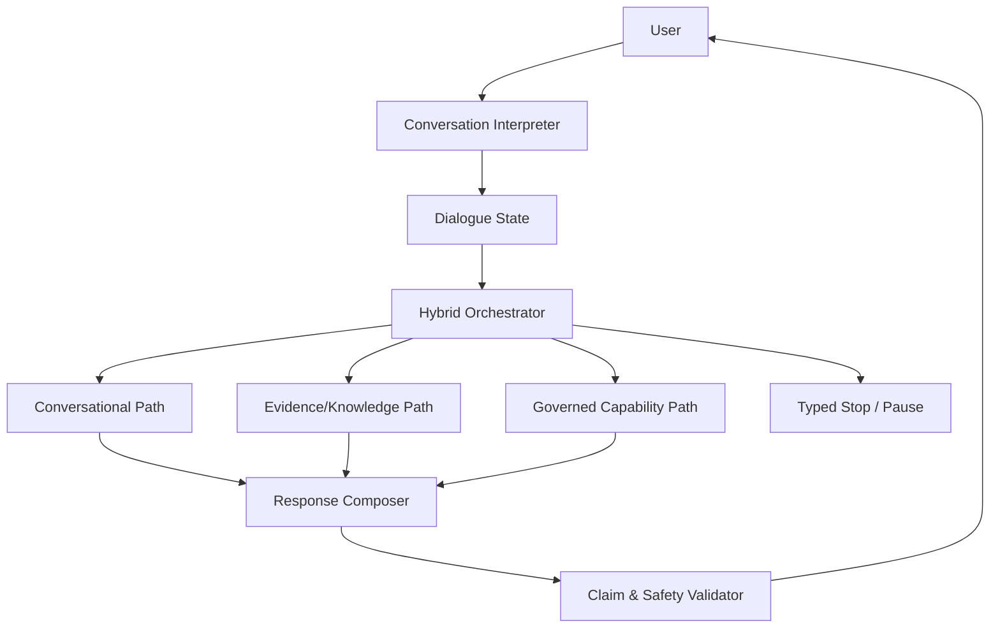

# Target de conversa natural

## Contratos

- `DialogueState`: goal, slots, ambiguity, pending question, interruptions e owner.
- `EvidenceSet`: claim type, source, version, freshness, confidence e tenant.
- `ProposedAction`: capability, resource, args, expected evidence e idempotency.
- `Decision`: next step + rationale bounded para audit, sem chain-of-thought.
- `StopReason`: completed, needs_input, approval, takeover, insufficient_evidence, denied, exhausted ou failure.

Princípios: linguagem pode variar; claim verificável sem evidence é removida/clarificada; ação sem capability/policy/approval é negada; high-risk sempre handoff/approval; takeover suprime automação. O composer recebe resultados já sanitizados e nunca credentials/raw private payloads.

Evals: naturalidade, ambiguidade, interrupção, groundedness por claim, tool/action appropriateness, handoff e refusal; sempre sem efeitos reais.
